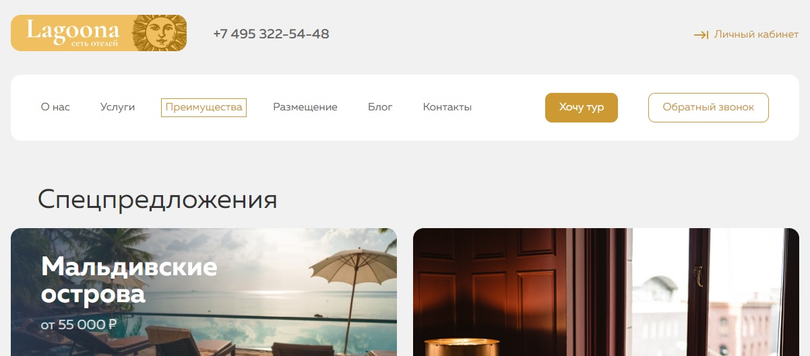
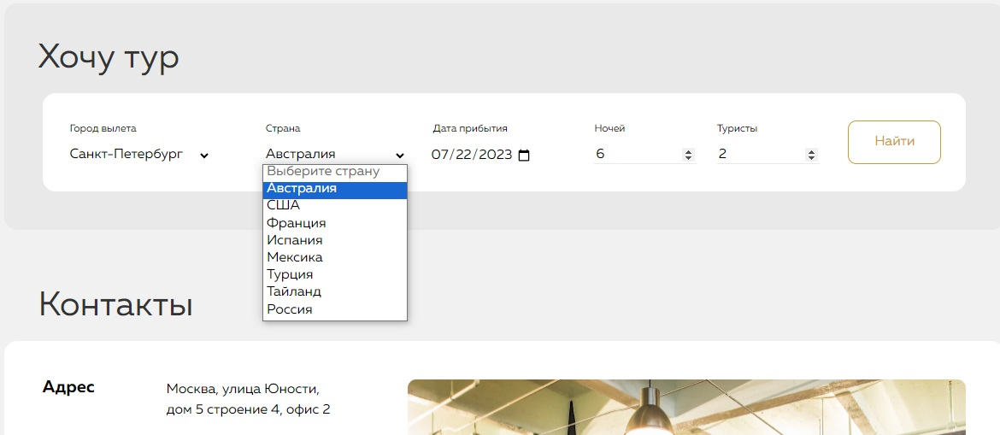
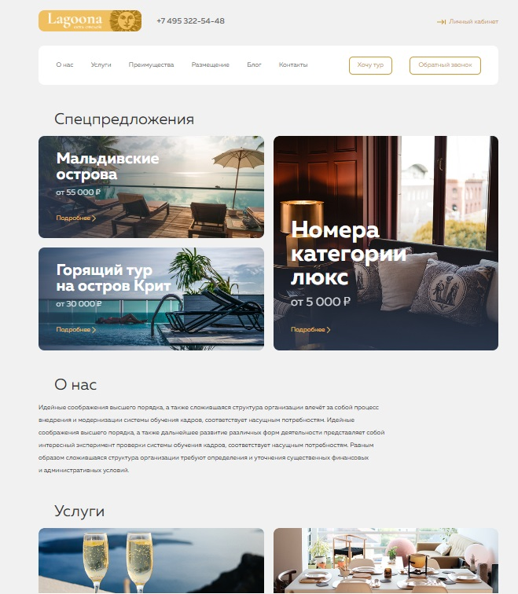
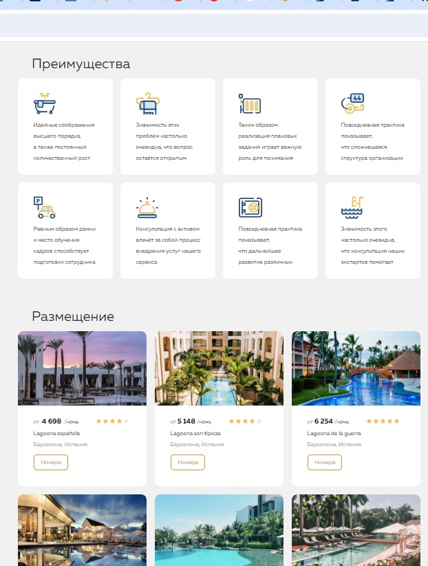
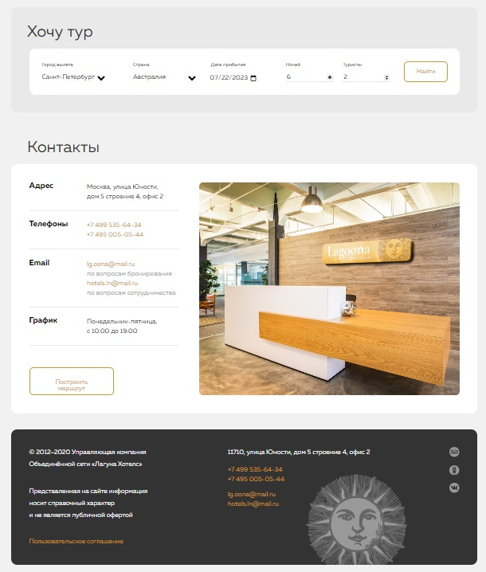

### Цель проекта:
Закрепить на практике работу с формами, CSS-псевдоклассами, псевдоэлементами и трансформациями.

### Задачи проекта:
1. Привести верстку в полное соответствие макету.
2. Добавить все декоративные изображения в верстку.
3. Сверстать форму и реализовать её отправку.
4. Применить псевдоклассы, псевдоэлементы, ховер-эффекты, трансформации.

### Реализация:

