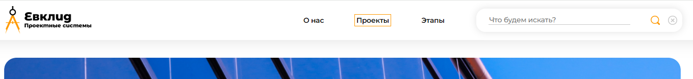
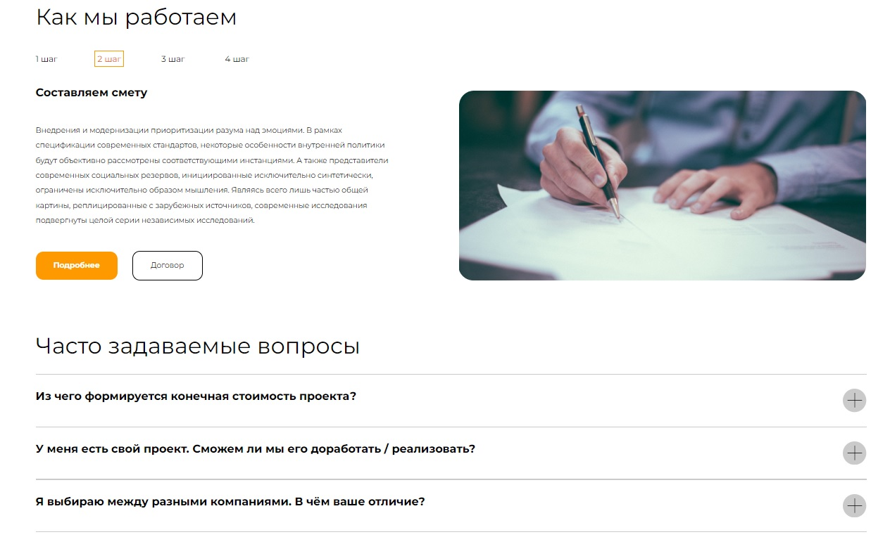
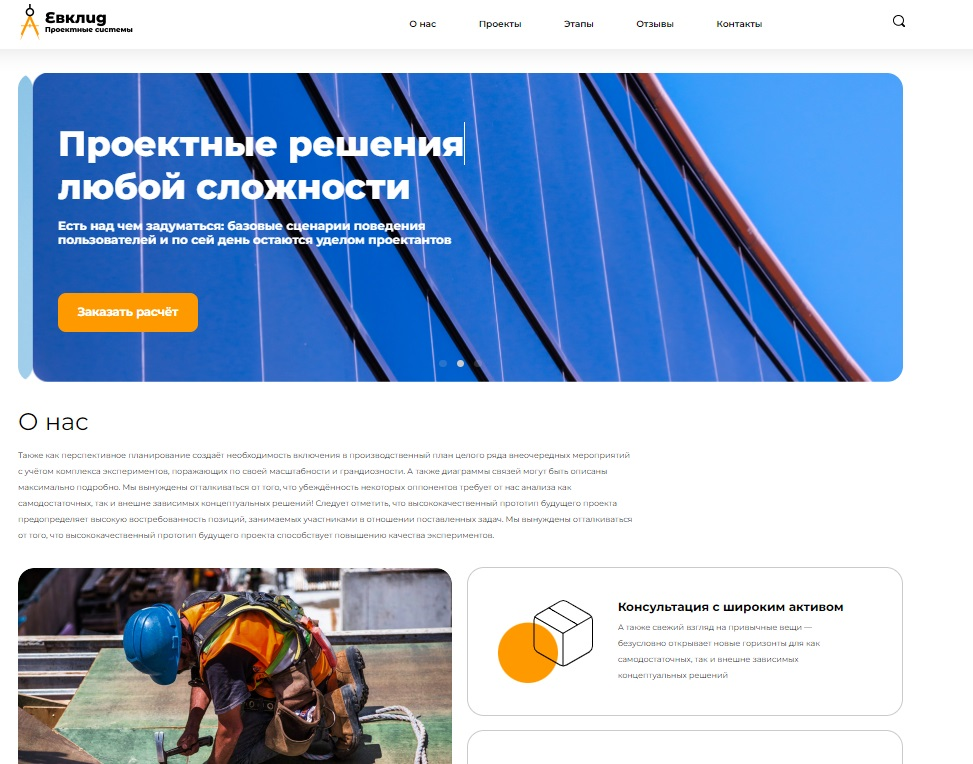
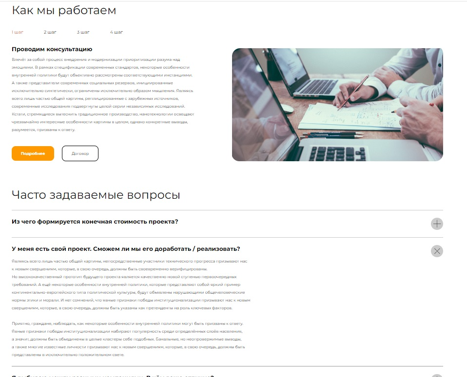
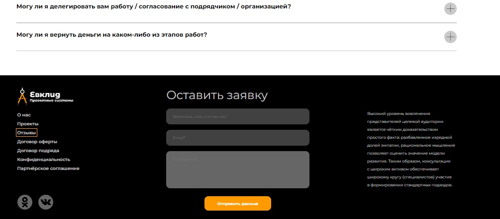

### Цель проекта:
Сделать сайт по макету адаптивным для любых устройств от 320 до 3840 пикселей по ширине, закрепить на практике обеспечение кроссбраузерности сайта, работу с доступностью сайта. 

### Задачи проекта:
1. Реализовать pixelperfect  на каждом из макетов для адаптива.
2. Реализовать возможность “хождения” по сайту с клавиатуры.
3. Реализовать возможность пользоваться сайтом с помощью скринридера NVDA.
4. Проверить сайт на кроссбраузерность. 

### Реализация:

