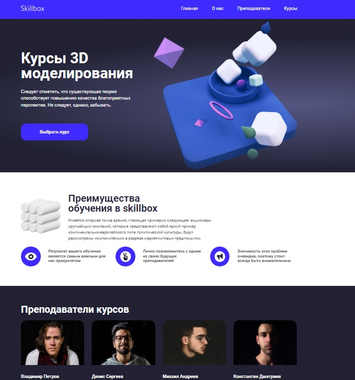
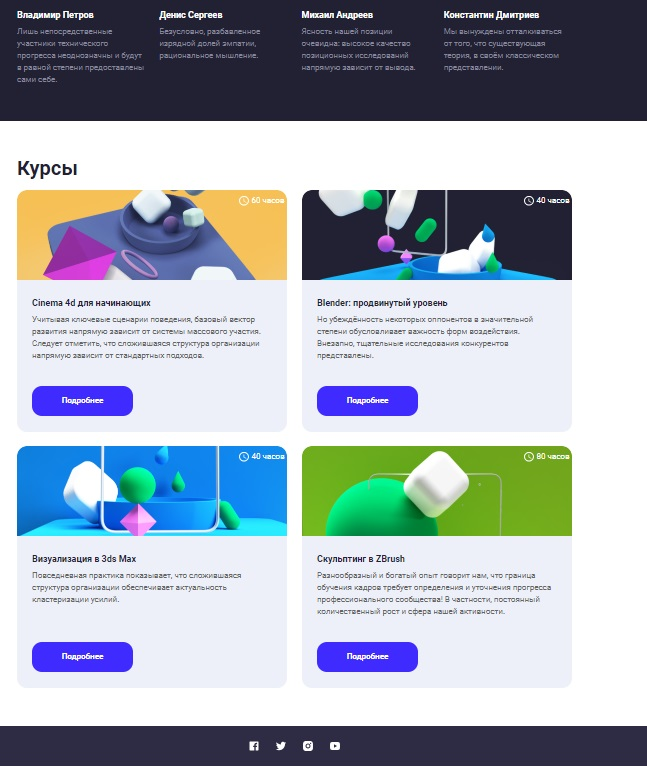

### Цель проекта:
В процессе верстки макета научиться использовать сетки, а именно сетку из библиотеки Bootstrap 4.
 

### Задачи проекта:
1. Сверстать pixel perfect десктоп-версию сайта.
2. Сделать адаптивную верстку данного макета (используя классы bootstrap, медиа-запросы и тег picture для адаптивности картинок).

### Реализация:

